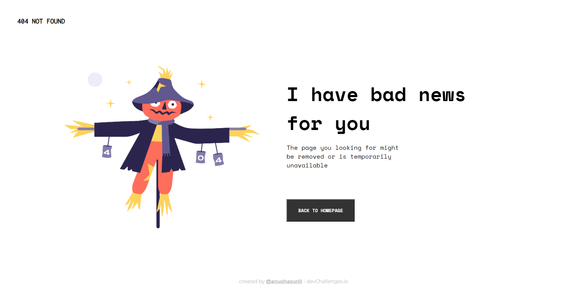
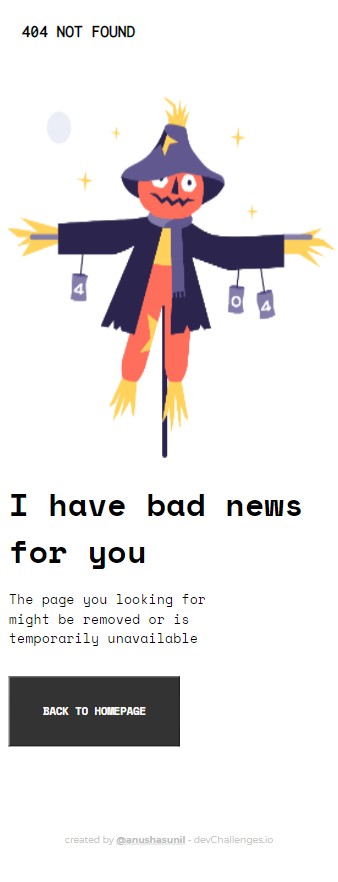

<!-- Please update value in the {}  -->

<h1 align="center">404-NOT-FOUND Page</h1>

   Solution for a challenge from  <a href="http://devchallenges.io" target="_blank">Devchallenges.io</a>.

  <h3>
    <a href="https://404-landing.netlify.app/">
      Demo
    </a>
     | 
    <a href="https://github.com/anushasunil/404-not-found-page">
      Solution
    </a>
     | 
    <a href="https://devchallenges.io/challenges/wBunSb7FPrIepJZAg0sY">
      Challenge
    </a>
  </h3>

<!-- TABLE OF CONTENTS -->

## Table of Contents

- [Overview](#overview)
  - [Built With](#built-with)
- [Features](#features)
- [Contact](#contact)
- [Acknowledgements](#acknowledgements)

<!-- OVERVIEW -->

## Overview

- Desktop view  
  
- Mobile view  
  

### Built With

<!-- This section should list any major frameworks that you built your project using. Here are a few examples.-->

- HTML
- CSS

## Features

<!-- List the features of your application or follow the template. Don't share the figma file here :) -->

This application/site was created as a submission to a [DevChallenges](https://devchallenges.io/challenges) challenge. The [challenge](https://devchallenges.io/challenges/wBunSb7FPrIepJZAg0sY) was to build an application to complete the given user stories.

## Contact

- Website [anushasunilkumar.netlify.app](https://anushasunilkumar.netlify.app/)
- GitHub [@anushasunil](https://github.com/anushasunil)
- Twitter [@anushasunil7](https://twitter.com/anushasunil7)
